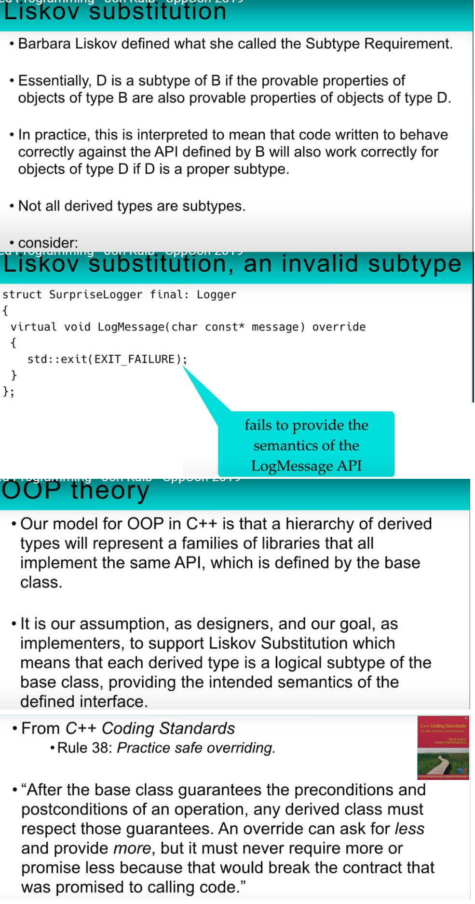
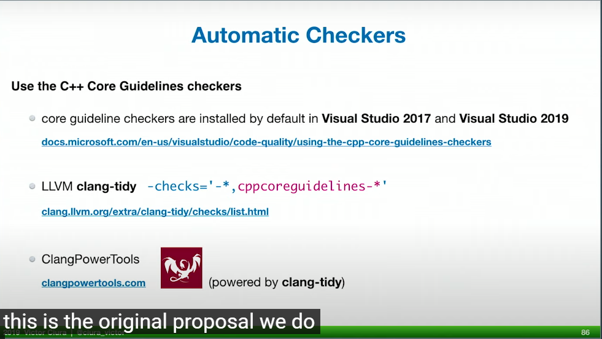
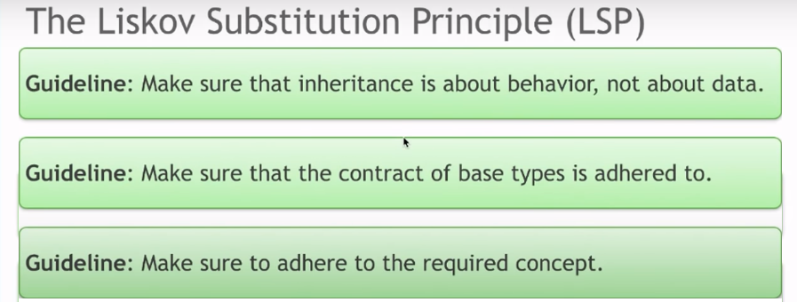
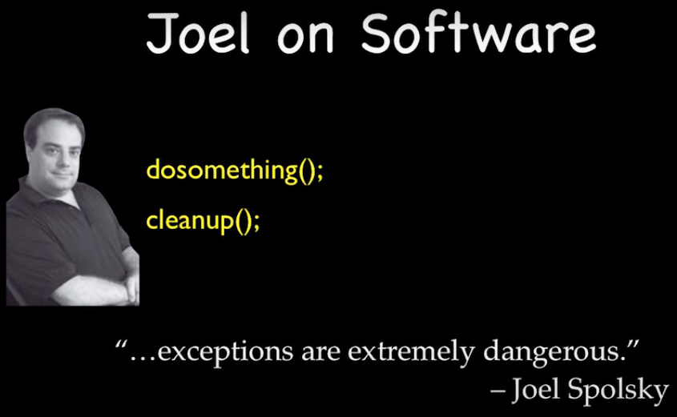
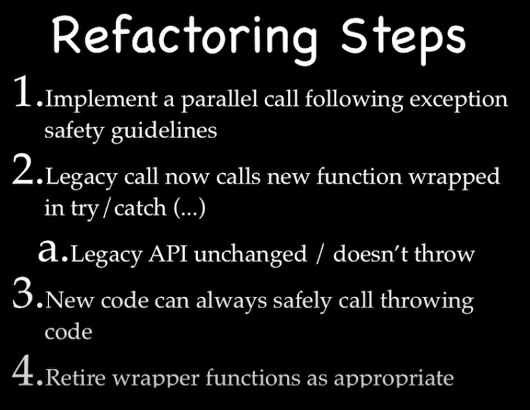

# [How to Choose the Right Standard Library Container, and Why You Should Want Some More - Alan Talbot](https://www.youtube.com/watch?v=yjPKVOYcw28&t=2183s)
 
 
[Vector recycling](https://youtu.be/yjPKVOYcw28?t=2228)  
 
 
# [9. Object-Oriented Programming - Jon Kalb - CppCon 2019](https://www.youtube.com/watch?v=32tDTD9UJCE&t=1221s)
Summary  
 
detail  
 
 
# [8. Sean Parent talk coding cpp](https://www.youtube.com/watch?v=W2tWOdzgXHA&list=WL&index=3&t=2075s)
 
# [7. Short life span](https://www.youtube.com/watch?v=J02S50z5zEo&t=769s)
  
  
  
  
  
  
# 6. SOLID
### [a - Klaus Iglberger](https://youtu.be/Ntraj80qN2k)  
  
  
  
  
  
  
# 5. Move
### [a - David Olsen](https://youtu.be/ZG59Bqo7qX4)  
  
# 4. Exception safe
### a - Jon Kalb
[Part I](https://youtu.be/W7fIy_54y-w)  
[Part II](https://youtu.be/b9xMIKb1jMk)  
[Part III](https://youtu.be/MiKxfdkMJW8)  
  
  
  
* Example implement for vector: what the problem??    
  
* Example implement for stack: what the problem??    

* The right way of thinking  

* Exception-Safety Guarantees (Abrahams)  

* Error dectection  

* noexcept  
  
* Ho to not `terminate`  
  
* Destructor  
  
* Aborted Construction  
  
* Fundamental object functions  
  
* Guidline to use noexcept  
  
* Use critical line  
  
  
* Most important design guidline  
  
* Exeption safety guidline  
  
* Sean Parent's Rules  
  
* Refactoring steps  
  
* Success path  
  

### b - [Klaus Iglberger](https://youtu.be/0ojB8c0xUd8)
Function that should never fail
* Destructors (implicitly marked as  `noexcept` since C++11)
* Move Operator (should marked as  `noexcept`)
* `swap` operations

# 3. Avoid virtual inheritance
"Avoid virtual base classes unless your design really insists on them" - [Stephen Dewhurst](https://youtu.be/SShSV_iV1Ko?t=3294)
# 2. Problem with inheritance
### a - Sy Brand talk  
[Dynamic Polymorphism with Metaclasses and Code Injection](https://www.youtube.com/watch?v=8c6BAQcYF_E)
* Often require dynamic allocation
* Ownership and nullability considerations
* Intrusive: require modifying child classes
* No more value semantics
* Changes semantics for algorthims and containers  
#### Link for this talk:
* code: [https://godbolt.org/z/bUDyhG](https://godbolt.org/z/bUDyhG)
* prototype: [https://github.com/tartanllama/typeclasses](https://github.com/tartanllama/typeclasses)
### b - Louis Dionne talk
[Runtime Polymorphism: Back to the Basics](https://www.youtube.com/watch?v=OtU51Ytfe04&t=4153s)
* code: [dyno](https://github.com/ldionne/dyno)
### c - Sean Parent talk
* [Inheritance Is The Base Class of Evil](https://www.youtube.com/watch?v=bIhUE5uUFOA)
* [Runtime Polymorphism](https://www.youtube.com/watch?v=QGcVXgEVMJg&list=PLKtBMOPB5ra9DeN_N6jEDg0eY07_sgTtk&index=10&t=363s)
* [code](https://github.com/pvthuyet/think-about-cpp/blob/main/ThinkAboutCpp/inheritant_is_the_base_class_of_evil.h)
### d - Boost
* [Boost.TypeErasure](https://www.boost.org/doc/libs/1_55_0/doc/html/boost_typeerasure.html#boost_typeerasure.introduction)
  
# 1. Retiring the Singleton Pattern
[Peter Muldoon talk](https://www.youtube.com/watch?v=K5c7uvWe_hw&t=2487s), [slide](https://github.com/CppCon/CppCon2020/tree/main/Presentations/retiring_the_singleton_pattern)
